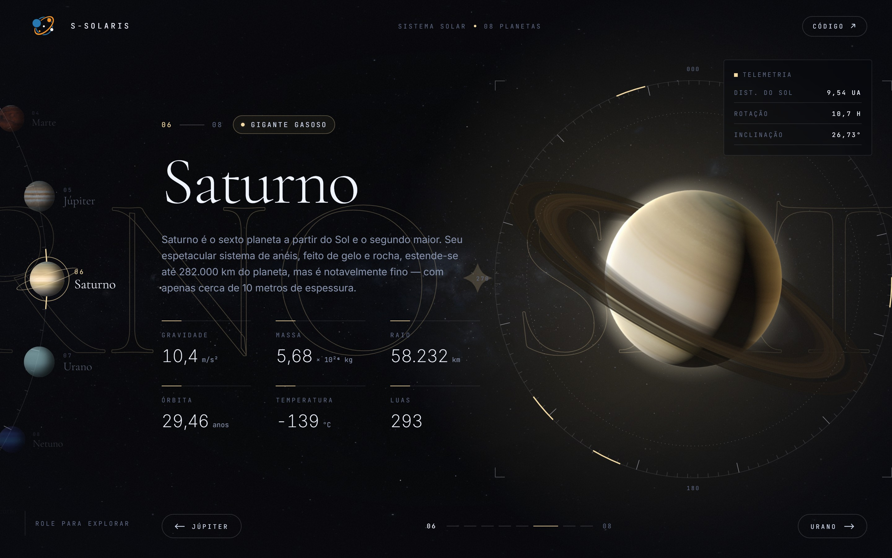
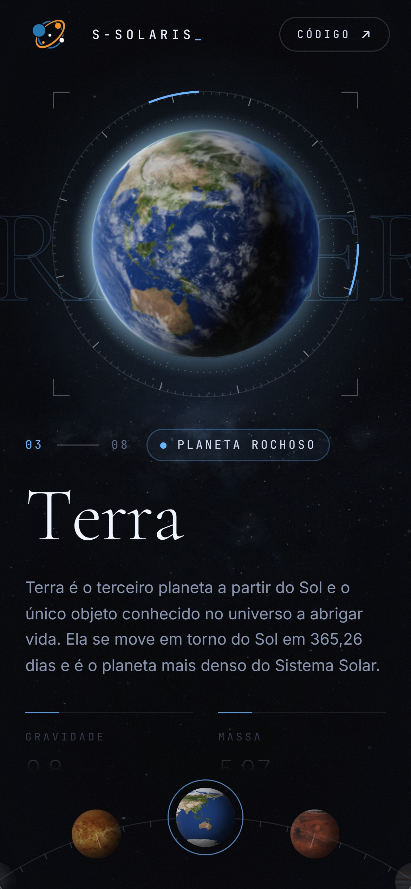

<h1 align="center">
  🪐 <a href="https://s-solaris.vercel.app">S-Solaris</a> 🪐
</h1>

<p align="center">
  Explore os oito planetas do Sistema Solar em uma experiência 3D animada, com dados astronômicos reais.
</p>

<p align="center">
  
  
  
</p>

<p align="center">
  <a href="https://s-solaris.vercel.app"><strong>🔭 Acessar o projeto</strong></a>
</p>

---

## 📑 Índice

<p align="center">
  <a href="#-sobre">📌 Sobre</a> • 
  <a href="#-layout">📸 Layout</a> • 
  <a href="#️-tecnologias">🛠️ Tecnologias</a> • 
  <a href="#-como-executar">🚀 Como executar</a> • 
  <a href="#-licença">📝 Licença</a> • 
  <a href="#-autora">👩🏻‍💻 Autora</a>
</p>

---

## 📌 Sobre

O **S-Solaris** é uma aplicação web para explorar os oito planetas do Sistema Solar de forma imersiva. Cada planeta é renderizado como uma esfera 3D com texturas reais e acompanhado de dados astronômicos obtidos pela API [Solar System OpenData](https://api.le-systeme-solaire.net), em uma interface construída com foco em animações fluidas e design cinematográfico.

A navegação acontece pelo scroll do mouse, pelo teclado ou por swipe no mobile. Cada interação dispara uma transição coreografada entre os planetas, com a roleta, as informações e a cena 3D sincronizadas.

### ✨ Funcionalidades

- Visualização 3D dos planetas com texturas reais, inclinação axial real, atmosfera, nuvens (Terra) e anéis (Saturno)
- Céu estrelado 3D com parallax do mouse e efeito de "salto" a cada troca de planeta
- Dados astronômicos de cada planeta: massa, gravidade, raio, órbita, temperatura, luas, distância do Sol e rotação
- Navegação por scroll, teclado (setas, Home/End e teclas de 1 a 8) e swipe
- Roleta em arco: vertical no desktop e horizontal no mobile
- Preloader com o progresso real do carregamento das texturas
- Animações com GSAP e Framer Motion: letras reveladas, contadores, textos "decodificados", nome do planeta em marquee, cursor customizado e botões magnéticos
- Interface que assume a cor de cada planeta
- Páginas de 404 e de erro no mesmo estilo visual, com um planeta animado em CSS
- Respeita a preferência de movimento reduzido do sistema
- Layout responsivo para mobile, tablet e desktop, incluindo telas de pouca altura

---

## 📸 Layout

Abaixo, uma demonstração da aplicação:

### 💻 Web

<div align="center">
  
</div>

### 📱 Mobile

<div align="center">
  
</div>

---

## 🛠️ Tecnologias

As seguintes tecnologias foram utilizadas no projeto:

- [React](https://react.dev/)
- [TypeScript](https://www.typescriptlang.org/)
- [Vite](https://vite.dev/)
- [Tailwind CSS](https://tailwindcss.com/)
- [Three.js](https://threejs.org/)
- [React Three Fiber](https://r3f.docs.pmnd.rs/getting-started/introduction) e [Drei](https://github.com/pmndrs/drei)
- [GSAP](https://gsap.com/)
- [Framer Motion](https://www.npmjs.com/package/framer-motion)
- [TanStack Query](https://tanstack.com/query/latest)
- [Axios](https://axios-http.com/)
- [Fontsource](https://fontsource.org/)
- [Solar System OpenData](https://api.le-systeme-solaire.net)

---

## 🚀 Como executar

### 📋 Pré-requisitos

- [Node.js](https://nodejs.org/) 20.19+ ou 22.12+
- Uma chave gratuita da API Solar System OpenData, gerada [neste link](https://api.le-systeme-solaire.net/generatekey.html)

### ⚙️ Rodando o aplicativo

```bash
# Clone este repositório
git clone https://github.com/impaulinha/s-solaris.git

# Acesse a pasta do projeto
cd s-solaris

# Instale as dependências
npm install

# Crie o arquivo de variáveis de ambiente
cp .env.example .env
```

Preencha o `.env` com a sua chave da API:

```env
VITE_SOLAR_API_KEY=sua-chave-aqui
```

Depois, execute a aplicação:

```bash
npm run dev
```

O navegador abrirá automaticamente em `http://localhost:5173`.

### 📜 Scripts disponíveis

| Comando           | Descrição                                        |
| ----------------- | ------------------------------------------------ |
| `npm run dev`     | Inicia o servidor de desenvolvimento             |
| `npm run build`   | Verifica os tipos e gera a versão de produção    |
| `npm run preview` | Serve localmente a versão de produção gerada     |
| `npm run lint`    | Analisa o código com o ESLint                    |
| `npm run format`  | Formata o código com o Prettier                  |

---

## 📝 Licença

Este projeto está sob a licença [MIT](./LICENSE).

---

## 👩🏻‍💻 Autora

Feito com ❤️ e dedicação por Ana Paula 😊. Entre em contato 👇

[](https://www.linkedin.com/in/anapaula-aguiar/)
[](mailto:anaaguiar20016@gmail.com)

- **Ana Paula Aguiar** - _Desenvolvedora Mobile_ - [anapaulaaguiar.dev](https://anapaulaaguiar.dev)

---
